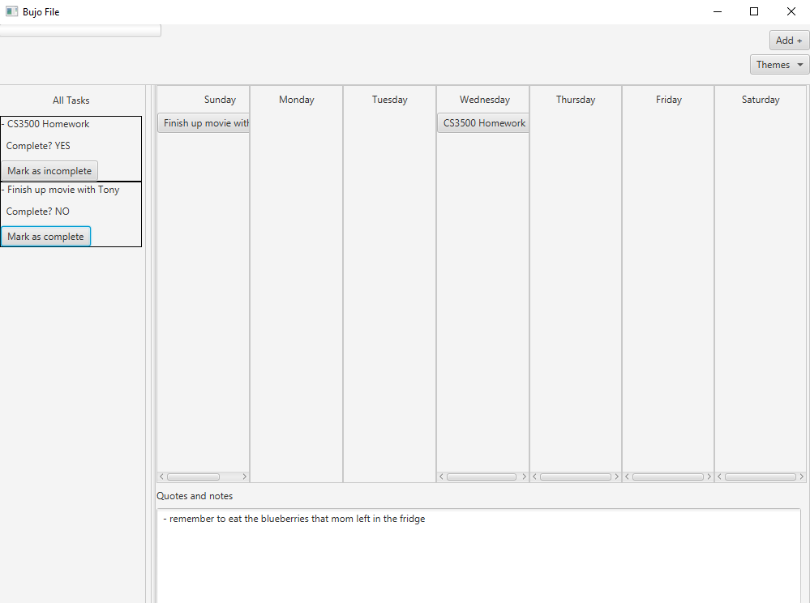
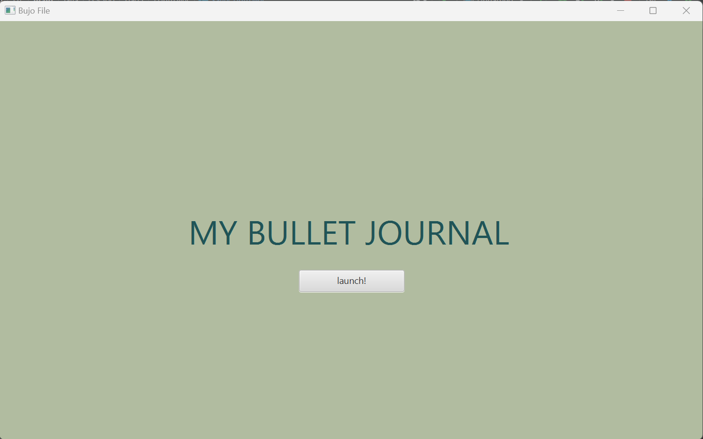
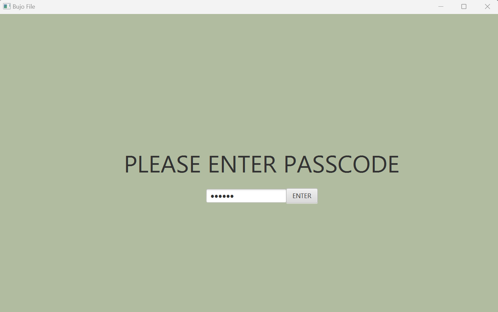
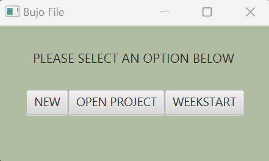
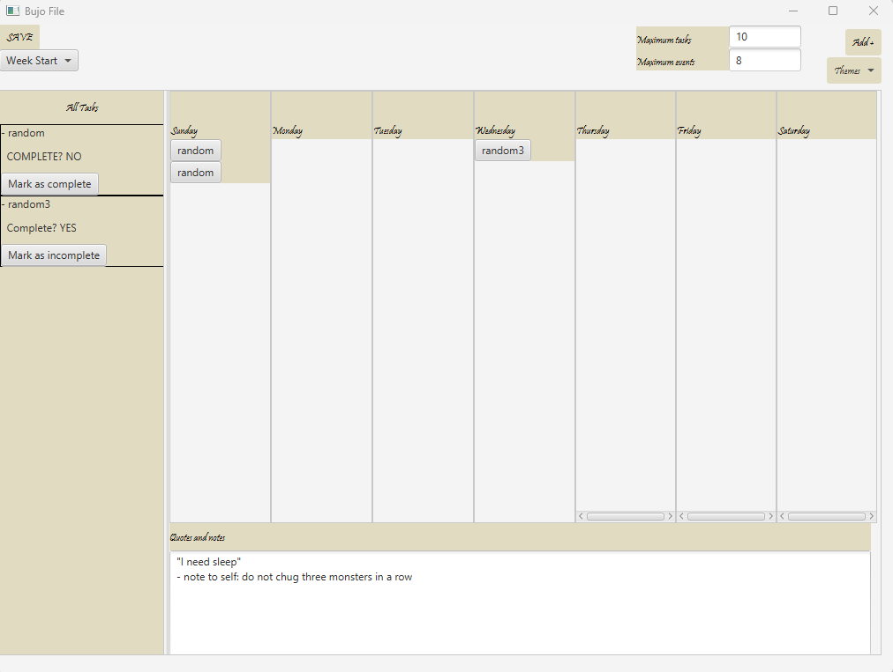

# 3500 PA05 Project Repo

[PA Write Up](https://markefontenot.notion.site/PA-05-8263d28a81a7473d8372c6579abd6481)
initial GUI

Introducing NicoleNamTony's Bullet Journal, the World's BEST bullet journal application. Our user-friendly bullet 
journal app is perfect for those who seeks to EFFORTLESSLY increase their organization and productivity levels. With
our top of the line features, we guarantee the best for all of our users.

Download NicoleNamTony's Bullet Journal now and experience the once in the lifetime opportunity to say goodbye to
unorganized chaos and low productivity levels!

## Features
- Week View: The view of the spread of an entire week!
- Event and Task Creation: Create tasks and events with all the information you want
- Persistence: Need to leave the application? Save your application via the Save button!
- Commitment Warnings: Set limits to the amount of tasks and events you can personally create
- Task Queue: Adding up all tasks for an entire week is too much. Why not have a sidebar with all of it? Oh yes, we do!
- Themes: One default theme is boring! We have plenty of themes to keep the journal spiced up!
- Quotes & Notes: Keep track of any quotes to keep you motivated or any notes to keep to yourself!
- Mini Viewer: In depth information about your created task(s) or event(s)!
- Takesie-Backsies: Have the ability to delete any task or event as freely as you want
- Week Start: Be able to choose what day to start you week off on.
- Links: Need to associate a Task or Event with a link? That link will be usable and clickable!
- Visual Flourish: Visual pleasure to keep bullet journaling fun!
- Splash Screen: A welcome screen to warmly welcome you to the application!
- Privacy Lock: Keep your bullet journal safe with a password lack to prevent your entries to be safe to just you!
- Weekly Starters: Got a nice looking bullet journal file? No problem! Import any .bujo file and use it as a template!

### How we could extend your program to include an additional feature
A feature we could extend our program to include would be the Mind Changes feature, where users can freely edit their
Tasks and Events, which includes the name and description.

#### What our Mini Viewer has in terms of JavaFX
For the name, it is put inside of a label, put in the middle of an HBox
For our description, it is put inside of a **NON-EDITABLE** TextArea.

#### How we can change our Mini Viewer to implement Mind Changes
We can implement an edit button next to the done button which toggles a mode where users can edit their name of their
event/task and description. The easiest approach is to change the name to a NON-EDITABLE TextArea as well, just like
the description box, then when edit mode is toggled via the Edit Button, we can set those TextAreas to be editable, then
save those changes, checking if the name is valid (NON-EMPTY) as well. If not valid, keep prompting the user to input 
a valid name for their event/task, or they cancel out of the edit mode via a Cancel Edit button.

#### How we applied SOLID
##### Single Responsibility
By following MVC, we were able to break down a lot of the tasks required of the GUI to help us follow single 
responsibilities. We also applied single responsibility by breaking down a lot of the functionality/components of the 
GUI such has having separate controllers and views for each section of the GUI, i.e. a controller and viewer for the 
splash screen, a controller and viewer for the passcode screen, a controller and viewer for the welcome screen etc. 
Moreover, we also had task/event classes, theme classes, and enums to represent the various data needed by the GUI.
Each class focused on storing data only relevant to them. For instance, theme classes only stored colors, and fonts and
task/event classes stored the names of the task/event, description, etc.

##### Open/Closed Principle
For our program, to ensure we followed the open/closed principle, we made sure to create interfaces containing basic
functionality to allow for further extension. We also made all of our fields private or protected to ensure our program 
would be closed to unwanted modification and added getters where necessary in order to retrieve information.

##### Liskov Substitution Principle
For our abstract task/event class, we made sure that it was abstracted properly so that if substituted with either the
task subclass or the event subclass, our program wouldn't break. We only kept the common fields between tasks and events
and some basic getter methods. Furthermore for our theme classes, because all themes have the same fields and the same
getters, we were able to abstract all of the fields and getters and put them in the abstract class. We then only had
a constructor in each theme subclass to set the actual fields.

##### Interface Segregation
We followed this by separating the responsibilities of interfaces and ensuring that there were no unnecessary methods
that any classes that implement them will have to override. For instance, our controller interfaces usually only hold 
the run method to avoid unnecessary method implementation.

##### Dependency Injection
A lot of our objects are dependent on other objects as we have a lot of objects in the parameters of other objects such
as our controllers who are passed in things like tasks or events. This is the same for a lot of our views. For instance,
our calendar view has a CalendarController passed in as a parameter.

### Screenshots of GUI features

